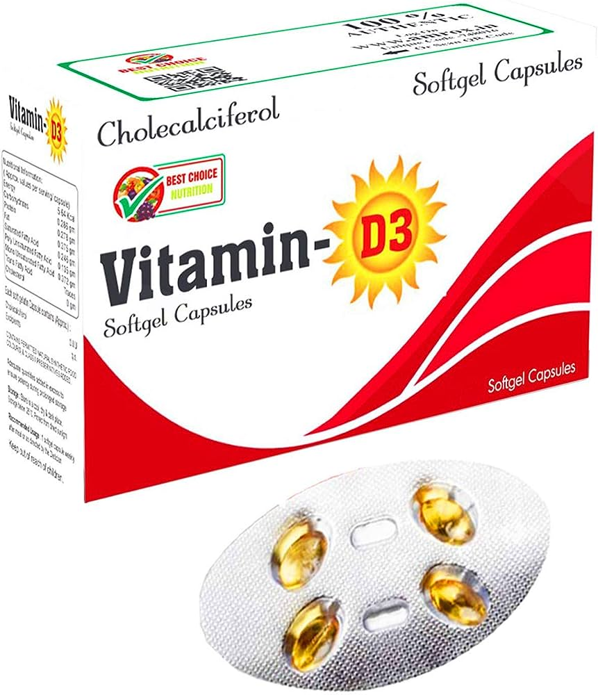
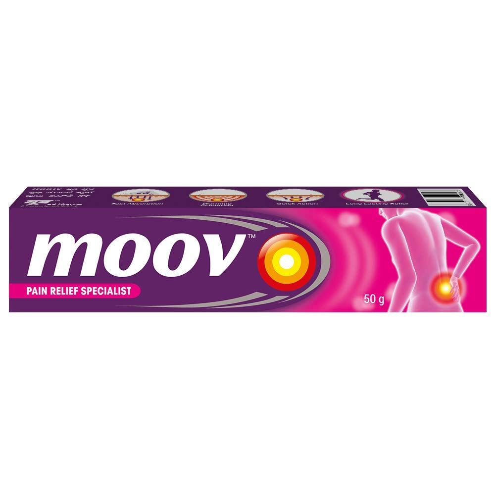

## Date:12.05.2024

## AIM:
To design a responsive website for a Pharmaceutical Company using Bootstrap.


## DESIGN STEPS:

### Step 1:
Clone the repository from GitHub.

### Step 2:
Create Django Admin project.

### Step 3:
Create a New App under the Django Admin project.

### Step 4:
Insert the necessary CSS and JavaScript files as external in order to use Bootstrap.

### Step 5:
Create a HTML file and include the needed Bootstrap components.

### Step 6:
Publish the website in the LocalHost.

## PROGRAM :
```
home
<!DOCTYPE html>
<html lang="en">
<head>
  <meta charset="UTF-8">
  <meta name="viewport" content="width=device-width, initial-scale=1.0">
  <title>Home - PharmaCompany</title>
  <!-- Bootstrap CSS -->
  <link href="https://stackpath.bootstrapcdn.com/bootstrap/4.5.2/css/bootstrap.min.css" rel="stylesheet">
  <!-- Custom CSS -->
  <style>
    body {
      background-image: url('bbb.jpg');
      background-size: cover;
      background-repeat: no-repeat;
    }
    footer{
      position: fixed;
      left: 0;
      bottom: 0;
      width: 100%;
      background-color: #343a40; 
      color: white;
      text-align: center;
      padding: 10px 0; 
    }
  </style>
</head>
<body>
  <nav class="navbar navbar-expand-lg navbar-dark bg-secondary">
    <a class="navbar-brand" href="#">VIGNESH PHARMACEUTICALS</a>
    <button class="navbar-toggler" type="button" data-toggle="collapse" data-target="#navbarSupportedContent" aria-controls="navbarSupportedContent" aria-expanded="false" aria-label="Toggle navigation">
      <span class="navbar-toggler-icon"></span>
    </button>

    <div class="collapse navbar-collapse" id="navbarSupportedContent">
      <ul class="navbar-nav mr-auto">
        <li class="nav-item active">
          <a font="large" class="nav-link" href="web.html">Home <span class="sr-only">(current)</span></a>
        </li>
        <li class="nav-item">
          <a class="nav-link" href="about.html">About</a>
        </li>
        <li class="nav-item">
          <a class="nav-link" href="product.html">Products</a>
        </li>
        <li class="nav-item">
          <a class="nav-link" href="contact.html">Contact</a>
        </li>
      </ul>
      <ul class="navbar-nav ml-auto">
        <li class="nav-item">
          <a class="nav-link" href="#">Login</a>
        </li>
        <li class="nav-item">
          <a class="nav-link" href="#">Register</a>
        </li>
      </ul>
    </div>
  </nav>
  <div class="container mt-5">
    <div class="row">
      <div class="col-md-8">
        <h1>Welcome to PharmaCompany</h1>
        <br>
        <br>
        <br>
        <h3>Welcome to PharmaCompany, your trusted source for high-quality pharmaceutical products. We are dedicated to improving the health and well-being of our customers by providing safe and effective medications.</h3>
        <br>
        <h3>At PharmaCompany, we offer a wide range of prescription and over-the-counter medications to meet your healthcare needs. Whether you're managing a chronic condition or simply looking for relief from minor ailments, we have the products you need.</h3>
        <br>
        <h3>Thank you for choosing PharmaCompany for your healthcare needs. We look forward to serving you and helping you live a healthier life.</h3>
      </div>
      <div class="col-md-4">
       
      </div>
    </div>
  </div>
  <footer class="bg-dark text-white text-center py-4 mt-5">
    <p>&copy; 2024 PharmaCompany. All rights reserved.by VIGNESH</p>
  </footer>
  <script src="https://code.jquery.com/jquery-3.5.1.slim.min.js"></script>
  <script src="https://cdn.jsdelivr.net/npm/popper.js@1.16.1/dist/umd/popper.min.js"></script>
  <script src="https://stackpath.bootstrapcdn.com/bootstrap/4.5.2/js/bootstrap.min.js"></script>
</body>
</html>

about

<!DOCTYPE html>
<html lang="en">
<head>
  <meta charset="UTF-8">
  <meta name="viewport" content="width=device-width, initial-scale=1.0">
  <title>About PharmaCompany</title>
  <link href="https://stackpath.bootstrapcdn.com/bootstrap/4.5.2/css/bootstrap.min.css" rel="stylesheet">
  <style>
    body {
      background-image: url('a.jpeg');
      background-size: cover;
      background-repeat: no-repeat;
    }
    footer{
    position: fixed;
      left: 0;
      bottom: 0;
      width: 100%;
      background-color: #343a40; 
      color: white;
      text-align: center;
      padding: 10px 0; 
    }
  </style>
</head>
<body>
  <nav class="navbar navbar-expand-lg navbar-dark bg-primary">
    <a class="navbar-brand" href="#">VIGNESH PHARMACEUTICALS</a>
    <button class="navbar-toggler" type="button" data-toggle="collapse" data-target="#navbarSupportedContent" aria-controls="navbarSupportedContent" aria-expanded="false" aria-label="Toggle navigation">
      <span class="navbar-toggler-icon"></span>
    </button>

    <div class="collapse navbar-collapse" id="navbarSupportedContent">
      <ul class="navbar-nav mr-auto">
        <li class="nav-item">
          <a class="nav-link" href="web.html">Home</a>
        </li>
        <li class="nav-item dropdown active">
          <a class="nav-link dropdown-toggle" href="about.html" id="navbarDropdownAbout" role="button" data-toggle="dropdown" aria-haspopup="true" aria-expanded="false">
            About
          </a>
          <div class="dropdown-menu" aria-labelledby="navbarDropdownAbout">
            <a class="dropdown-item" href="#vision">Vision</a>
            <a class="dropdown-item" href="#mission">Mission</a>
            <a class="dropdown-item" href="#values">Values</a>
            <!-- Add more subheadings as needed -->
          </div>
        </li>
        <li class="nav-item">
          <a class="nav-link" href="product.html">Products</a>
        </li>
        <li class="nav-item">
          <a class="nav-link" href="#">Contact</a>
        </li>
      </ul>
    </div>
  </nav>
  <div class="container mt-5">
    <div class="row">
      <div class="col-md-12">
        <h1>About PharmaCompany</h1>
        <div id="vision">
          <h2>Vision</h2>
          <p>Our vision is to be a leading provider of innovative healthcare solutions that improve the quality of life for people around the world.</p>
        </div>
        <div id="mission">
          <h2>Mission</h2>
          <p>Our mission is to develop and deliver safe, effective, and affordable medications that address the healthcare needs of our customers.</p>
        </div>
        <div id="values">
          <h2>Values</h2>
          <ul>
            <li>Quality: We are committed to maintaining the highest standards of quality in everything we do.</li>
            <li>Integrity: We conduct our business with honesty, transparency, and ethical behavior.</li>
            <li>Innovation: We strive to continuously innovate and improve our products and services to better serve our customers.</li>
            <li>Customer Focus: We are dedicated to understanding and meeting the needs of our customers.</li>
            <li>Teamwork: We work together as a team to achieve our goals and deliver exceptional results.</li>
          </ul>
        </div>
      </div>
    </div>
  </div>
  <footer class="bg-dark text-white text-center py-4 mt-5">
    <p>&copy; 2024 PharmaCompany. All rights reserved by VIGNESH V</p>
  </footer>
  <script src="https://code.jquery.com/jquery-3.5.1.slim.min.js"></script>
  <script src="https://cdn.jsdelivr.net/npm/popper.js@1.16.1/dist/umd/popper.min.js"></script>
  <script src="https://stackpath.bootstrapcdn.com/bootstrap/4.5.2/js/bootstrap.min.js"></script>
</body>
</html>

contact


<!DOCTYPE html>
<html lang="en">
<head>
  <meta charset="UTF-8">
  <meta name="viewport" content="width=device-width, initial-scale=1.0">
  <title>Contact Us - PharmaCompany</title>
  <link href="https://stackpath.bootstrapcdn.com/bootstrap/4.5.2/css/bootstrap.min.css" rel="stylesheet">
  <style>
    body {
      background-image: url('bbb.jpg');
      background-size: cover;
      background-repeat: no-repeat;
    }
    footer{
      position: fixed;
      left: 0;
      bottom: 0;
      width: 100%;
      background-color: #343a40; 
      color: white;
      text-align: center;
      padding: 10px 0; 
    }
  </style>
</head>
<body>
  <nav class="navbar navbar-expand-lg navbar-dark bg-secondary">
    <a class="navbar-brand" href="#">VIGNESH PHARMACEUTICALS</a>
    <button class="navbar-toggler" type="button" data-toggle="collapse" data-target="#navbarSupportedContent" aria-controls="navbarSupportedContent" aria-expanded="false" aria-label="Toggle navigation">
      <span class="navbar-toggler-icon"></span>
    </button>
    <div class="collapse navbar-collapse" id="navbarSupportedContent">
      <ul class="navbar-nav mr-auto">
        <li class="nav-item">
          <a class="nav-link" href="web.html">Home</a>
        </li>
        <li class="nav-item">
          <a class="nav-link" href="about.html">About</a>
        </li>
        <li class="nav-item">
          <a class="nav-link" href="product.html">Products</a>
        </li>
        <li class="nav-item active">
          <a class="nav-link" href="contact.html">Contact <span class="sr-only">(current)</span></a>
        </li>
      </ul>
    </div>
  </nav>
  <div class="container mt-5">
    <div class="row">
      <div class="col-md-8">
        <h1>Contact Us</h1>
        <p>For any inquiries or feedback, please fill out the form below and we will get back to you as soon as possible.</p>
        <form>
          <div class="form-group">
            <label for="name">Your Name</label>
            <input type="text" class="form-control" id="name" placeholder="Enter your name">
          </div>
          <div class="form-group">
            <label for="email">Your Email</label>
            <input type="email" class="form-control" id="email" placeholder="Enter your email">
          </div>
          <div class="form-group">
            <label for="message">Message</label>
            <textarea class="form-control" id="message" rows="5" placeholder="Enter your message"></textarea>
          </div>
          <button type="submit" class="btn btn-primary">Submit</button>
        </form>
      </div>
      <div class="col-md-4">
        <h2>VIGNESH PHARMACEUTICALS</h2>
        <address>
          <strong>Address:</strong><br>
          238 albert street, Chennai<br>
          India, 600001<br><br>
          <strong>Email:</strong><br>
          info@vigneshpharmaceuticals.com<br><br>
          <strong>Phone:</strong><br>
          +1234567890
        </address>
      </div>
    </div>
  </div>
  <footer class="bg-dark text-white text-center py-4 mt-5">
    <p>&copy; 2024 PharmaCompany. All rights reserved by VIGNESH V</p>
  </footer>
  <script src="https://code.jquery.com/jquery-3.5.1.slim.min.js"></script>
  <script src="https://cdn.jsdelivr.net/npm/popper.js@1.16.1/dist/umd/popper.min.js"></script>
  <script src="https://stackpath.bootstrapcdn.com/bootstrap/4.5.2/js/bootstrap.min.js"></script>
</body>
</html>

product

<!DOCTYPE html>
<html lang="en">
<head>
  <meta charset="UTF-8">
  <meta name="viewport" content="width=device-width, initial-scale=1.0">
  <title>Products - PharmaCompany</title>
  <link href="https://stackpath.bootstrapcdn.com/bootstrap/4.5.2/css/bootstrap.min.css" rel="stylesheet">
  <style>
    body {
      background-image: url('bbb.jpg');
      background-size: cover;
      background-repeat: no-repeat;
    }
    footer{
      position: fixed;
      left: 0;
      bottom: 0;
      width: 100%;
      background-color: #343a40; 
      color: white;
      text-align: center;
      padding: 10px 0; 
    }
  </style>
</head>
<body>
  <nav class="navbar navbar-expand-lg navbar-dark bg-secondary">
    <a class="navbar-brand" href="#">VIGNESH PHARMACEUTICALS</a>
    <button class="navbar-toggler" type="button" data-toggle="collapse" data-target="#navbarSupportedContent" aria-controls="navbarSupportedContent" aria-expanded="false" aria-label="Toggle navigation">
      <span class="navbar-toggler-icon"></span>
    </button>

    <div class="collapse navbar-collapse" id="navbarSupportedContent">
      <ul class="navbar-nav mr-auto">
        <li class="nav-item">
          <a class="nav-link" href="web.html">Home</a>
        </li>
        <li class="nav-item">
          <a class="nav-link" href="about.html">About</a>
        </li>
        <li class="nav-item active">
          <a class="nav-link" href="product.html">Products <span class="sr-only">(current)</span></a>
        </li>
        <li class="nav-item">
          <a class="nav-link" href="contact.html">Contact</a>
        </li>
      </ul>
      <ul class="navbar-nav ml-auto">
        <li class="nav-item">
          <a class="nav-link" href="#">Login</a>
        </li>
        <li class="nav-item">
          <a class="nav-link" href="#">Register</a>
        </li>
      </ul>
    </div>
  </nav>
  <div class="container mt-5">
    <div class="row">
      <div class="col-md-12">
        <h1>Our Products</h1>
        <div class="card-deck">
          <div class="card">
            
            <div class="card-body">
              <h5 class="card-title">Retinol</h5>
             
              <a href="#" class="btn btn-primary">Buy Now</a>
            </div>
          </div>
          <div class="card">
            
            <div class="card-body">
              <h5 class="card-title">Vitamine D Tablets</h5>
              <a href="#" class="btn btn-primary">Buy Now</a>
            </div>
          </div>
          <div class="card">
            
            <div class="card-body">
              <h5 class="card-title">Moov</h5>
              <a href="#" class="btn btn-primary">Buy Now</a>
            </div>
          </div>
        </div>
      </div>
    </div>
  </div>
  <footer class="bg-dark text-white text-center py-4 mt-5">
    <p>&copy; 2024 PharmaCompany. All rights reserved by VIGNESH V</p>
  </footer>
  <script src="https://code.jquery.com/jquery-3.5.1.slim.min.js"></script>
  <script src="https://cdn.jsdelivr.net/npm/popper.js@1.16.1/dist/umd/popper.min.js"></script>
  <script src="https://stackpath.bootstrapcdn.com/bootstrap/4.5.2/js/bootstrap.min.js"></script>
</body>
</html>
```

## OUTPUT:


## RESULT:
The Project for responsive web design using Bootstrap is completed successfully.
